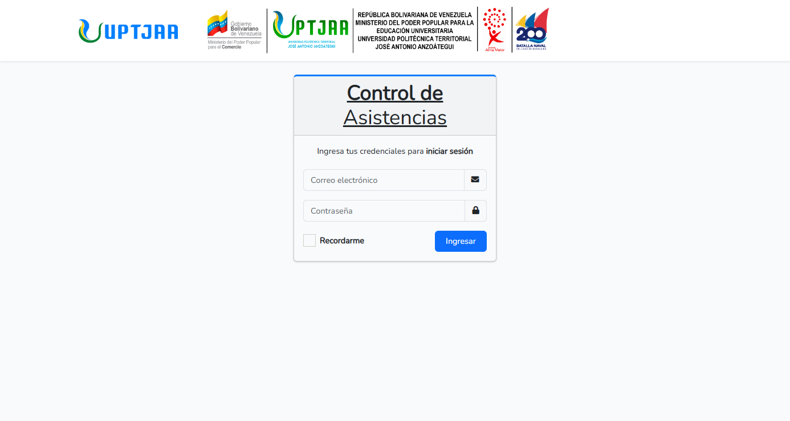
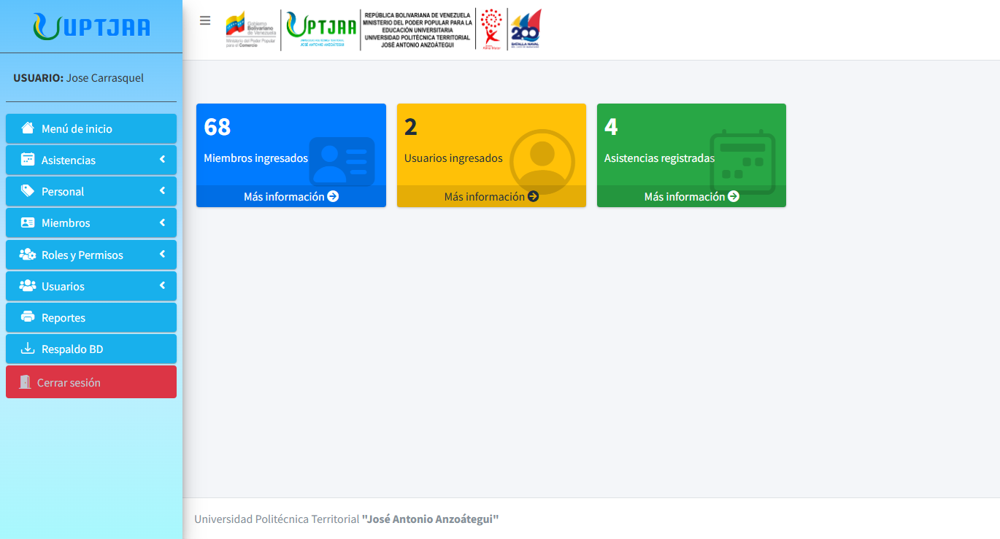
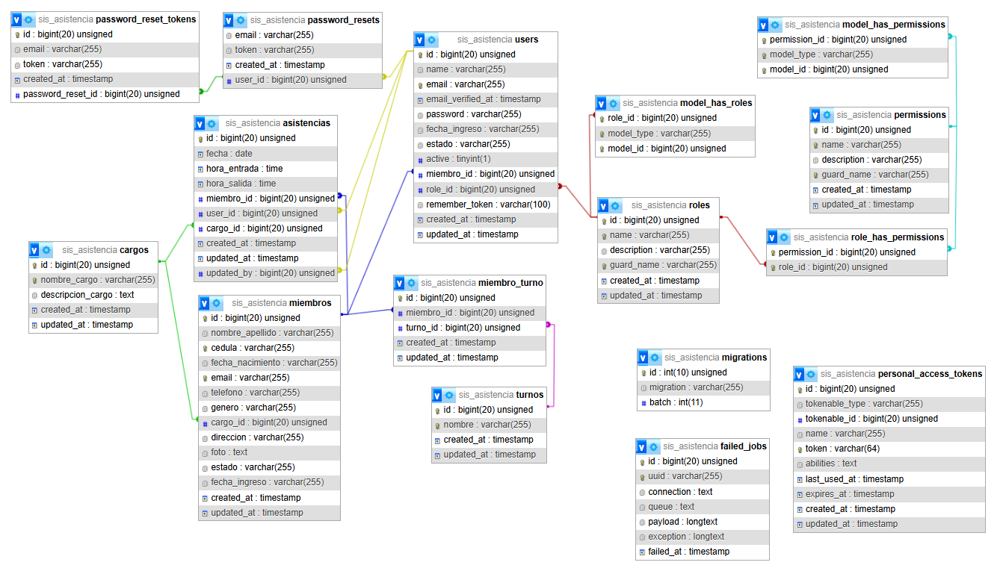

# 📌 Sistema de Registro y Control de Asistencias

  

Este proyecto fue desarrollado en **Laravel** como mi proyecto final de grado en la universidad.  
Fue parte de mi **tesis**, y representa un logro importante para mí al poder completar un sistema funcional y bien estructurado.

---

## 🚀 Descripción del Sistema

El **Sistema de Registro y Control de Asistencias** permite gestionar de manera eficiente el control del personal dentro de una institución.  
Entre sus principales características se encuentran:

- 👤 **Gestión de miembros** con información personal y turnos asignados.  
- ⏱️ **Registro de asistencias** con hora de entrada y salida.  
- 🧑‍💻 **Administración de usuarios** con roles y permisos personalizados.  
- 📊 **Generación de reportes en PDF** por rango de fechas o tipo de personal.  
- 💾 **Respaldo de base de datos** con un solo clic.  
- 🔐 **Buenas prácticas de seguridad** para proteger la información.  

---

## 🖼️ Capturas de Pantalla

  

---

## 📖 Manual de Usuario (Resumen)

- **Acceso y autenticación** → Login con correo y contraseña.  
- **Panel principal** → Accesos rápidos a usuarios, miembros y asistencias.  
- **Asistencias** → Registro y consulta de entradas y salidas.  
- **Usuarios** → Creación, edición y habilitación/deshabilitación de cuentas.  
- **Roles y permisos** → Configuración de accesos personalizados.  
- **Reportes** → Exportación en PDF con filtros avanzados.  
- **Respaldo de datos** → Copia de seguridad de la base de datos.  

> Para más detalle consulta el [Manual completo](./MANUAL%20DEL%20SISTEMA.pdf).

---

✍️ **Nota Personal:**  
Este sistema fue desarrollado como parte de mi **proyecto de grado universitario**.  
Más allá de un trabajo académico, fue un reto personal y profesional que me permitió aplicar mis conocimientos en **Laravel**, **MySQL** y **buenas prácticas de desarrollo web**.
